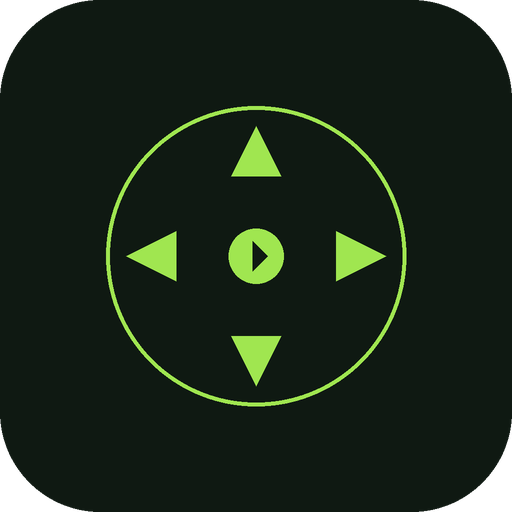

<p align="center">
  
</p>

<h1 align="center">Iyakku</h1>

<p align="center">
  <em>Your phone becomes a remote control for your laptop</em><br>
  Browse folders, swipe through photos, play videos, and control presentations — all from your phone over WiFi.
</p>

<p align="center">
  <a href="https://github.com/sathis-raj/iyakku/releases">Download</a> &nbsp;&bull;&nbsp;
  <a href="#install--run">Install</a> &nbsp;&bull;&nbsp;
  <a href="#features">Features</a>
</p>

---

## How It Works

1. **Launch Iyakku** on your laptop
2. **Scan the QR code** with your phone (or open the URL)
3. **Browse and control** media from your phone — it plays on the laptop

Both devices must be on the same WiFi network. No accounts, no cloud, no internet required.

## Install & Run

### Option A: Download the app

1. Download the latest release for your platform from [Releases](https://github.com/sathis-raj/iyakku/releases):
   - **macOS (Apple Silicon)**: `Iyakku-macOS-arm64.zip`
   - **macOS (Intel)**: `Iyakku-macOS-x86_64.zip`
   - **Windows**: `Iyakku-Windows-x64.zip`
2. Unzip and **double-click** `Iyakku.app` (macOS) or `Iyakku.exe` (Windows)
3. A window will appear with a QR code — scan it with your phone

> **macOS note**: On first launch, right-click the app and select "Open" to bypass Gatekeeper. You'll also be prompted to allow network access and (for presentation control) Accessibility permissions.

### Option B: pip install

```bash
pip install iyakku
iyakku
```

This opens a GUI window with the QR code. Alternatively, run in terminal-only mode:

```bash
python -m iyakku
```

### Option C: Run from source

```bash
git clone https://github.com/sathis-raj/iyakku.git
cd iyakku
pip install -e .
iyakku
```

### Building the standalone app

```bash
pip install -e ".[dev]"
pyinstaller iyakku.spec
```

Creates `dist/Iyakku.app` (macOS) or `dist/Iyakku/Iyakku.exe` (Windows).

## Features

### Media Support
- **Photos** — Swipe to navigate, pinch to zoom, pan when zoomed, rotate, double-tap quick zoom
- **Video & Audio** — Play/pause, seek bar, skip forward/back 10s, volume control, scrub timeline with long press + drag
- **Presentations** — Open PowerPoint, Keynote, or PDF in native apps and control slides with swipe gestures
- **Slideshow** — Auto-advance with 3s/5s/10s intervals, shuffle mode

### Browsing & Navigation
- **Folder browser** — Browse your entire filesystem from your phone
- **Breadcrumb navigation** — Tap any path segment to jump directly to that folder
- **Parent folder** — Go up one level without navigating back to the root
- **Media type filters** — Filter by Photos, Videos, Audio, or Docs
- **Search** — Find media files by name with real-time results
- **Recursive scan** — View all media including subfolders
- **Thumbnail strip** — Quickly jump between media files
- **Sort** — Sort by name, date, or size

### Controller & Security
- **PIN authentication** — 4-digit PIN secures controller access (created on first use)
- **Single controller lock** — Only one phone can control at a time
- **Gesture guide** — Built-in help overlay showing all available touch gestures

### Desktop App
- **GUI launcher** — QR code, connection status indicator, and PIN management
- **Auto viewer** — Browser opens automatically when you select your first media
- **Reset PIN** — Reset the PIN directly from the launcher

### Other
- **PWA** — Add the controller to your phone's home screen for a native app-like experience
- **Cross-platform** — macOS (Apple Silicon & Intel), Windows, and Linux via pip
- **Zero config** — No accounts, no cloud, no internet required

## Supported Formats

| Type | Formats |
|------|---------|
| Images | JPG, PNG, GIF, BMP, WebP, HEIC, TIFF |
| Video | MP4, WebM, MOV, MKV, AVI, M4V |
| Audio | MP3, WAV, M4A, AAC, FLAC, OGG, WMA |
| Presentations | PPTX, PPT, PDF, KEY, ODP |

## Requirements

- Python 3.9+ (only if installing via pip)
- Same WiFi network for laptop and phone
- macOS, Windows, or Linux

## License

[MIT](LICENSE)
